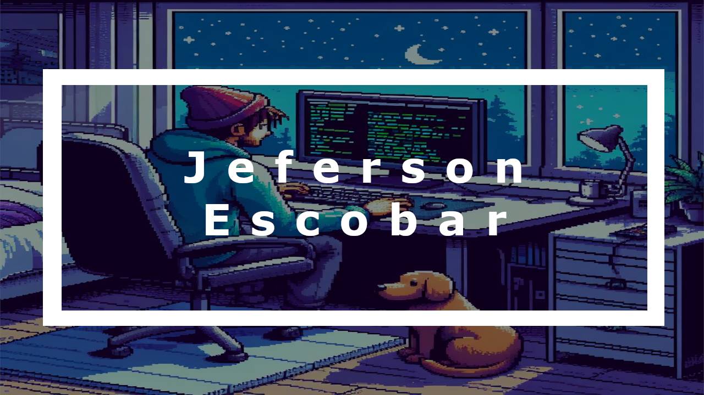

    

<h1 align="center">¡Hola, mundo! 👋</h1>

    
    
    

### Programador Autodidacta 🤓 | Apasionado por la Tecnología 🖥️ | Amante del Café ☕ | Lofi Chill 🎵 | 

¡Bienvenido(a) a mi rincón digital! Soy un apasionado desarrollador que busca soluciones tecnológicas y entregar todo de mi. Me encanta explorar nuevas tecnologías y contribuir al mundo del código abierto.

> Programar es como componer poesía para máquinas, donde cada línea de código es una estrofa que da vida a la sinfonía de la tecnología. __Jeferson__

## 💻 Tecnologías y Herramientas

### **Lenguajes de Programación:** 
 
 
 
 
 

 
### **Bases de Datos:** 

### **Herramientas de Desarrollo:**

### **Otras Tecnologías:**

## 🚀 Proyectos Destacados

### [Lia IA Simulacion](enlace-al-proyecto-1)
Lia, es una asistente de voz que simula el funcionamiento de una Inteligencia Artificial completa, además ejecuta tareas que ya vienen especificadas en el codigo, las recibe por voz y responde por voz, ambas formas.

<!-- Estadisticas impresionantes -->
<!-- Logros destacados -->

### [Snake Game](enlace-al-proyecto-2)
Clon del juegos Snake, con una interfaz intuitiva y agilidad en los controles, se puede modificar el comportamiento del juego por medio de una GUI que permite no solo cambiar la velocidad o cosas basicas, tambien permite cambiar el color de la serpiente, la fruta, ademas pertime registrar el nombre del usuario para guardar su progreso.

<!-- Estadisticas impresionantes -->
<!-- Logros destacados -->

## 🌟 Actividad

<!-- Agregar otra card Diferente -->

## 🌱 Actualmente Aprendiendo

Me encuentro en una emocionante jornada de aprendizaje constante. Algunas de las tecnologías que estoy explorando actualmente incluyen:

- C++
- Machine Learning con TensorFlow
- Go

    

    

    25%

    

    

    40%

    

    

    30%

<!-- Poner tres imagenes sobre lo que me encuentro aprendiendo -->
---

En el mundo 🌍 de la tecnología 💻 nunca se para de aprender 📈 (a menos que mueras 🫠).

